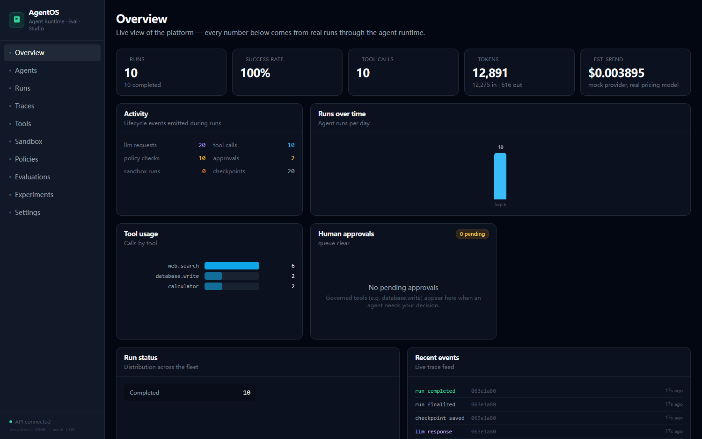
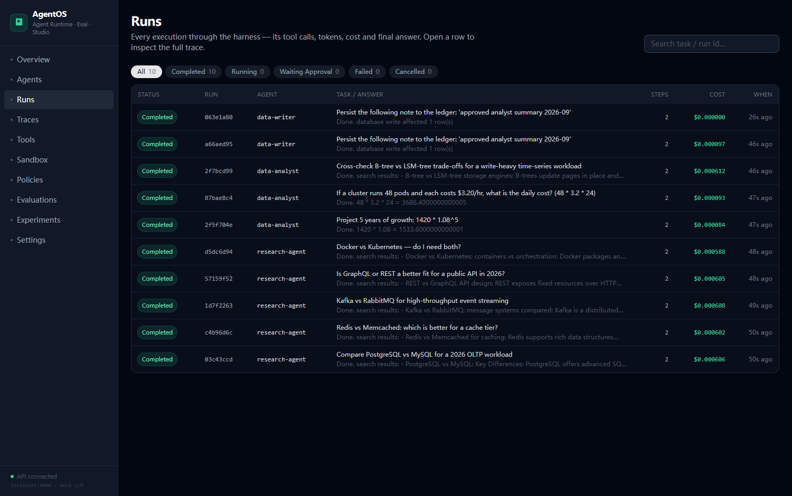
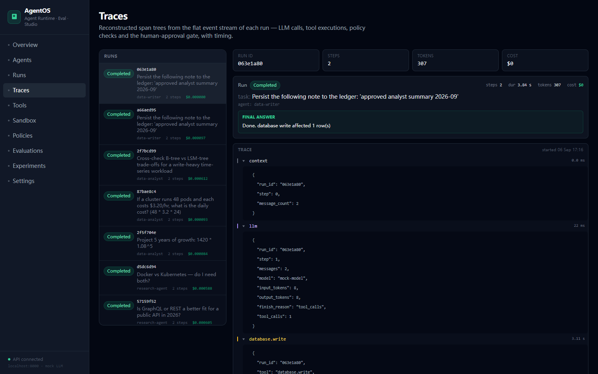
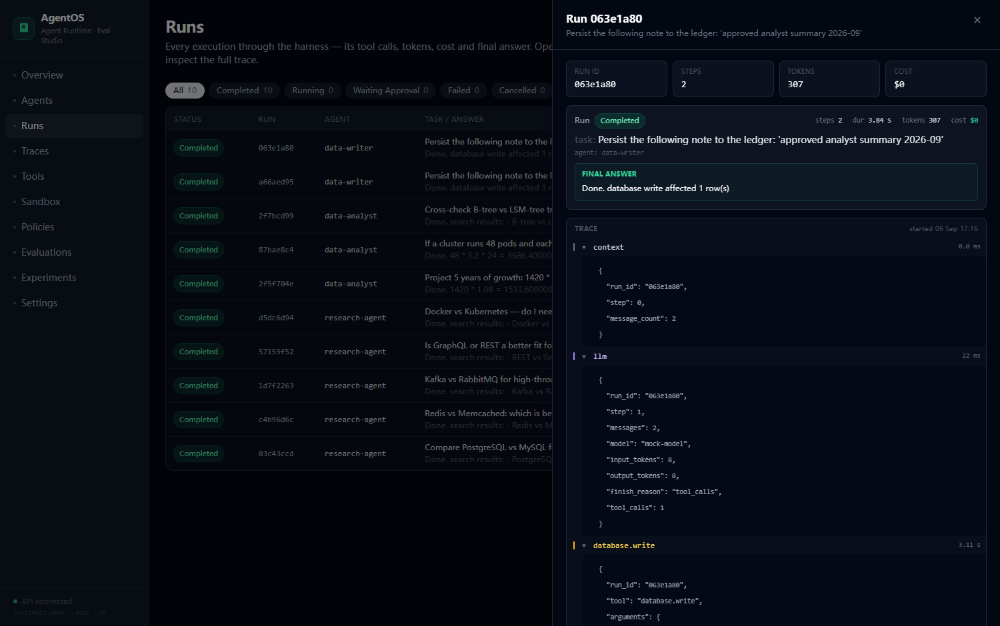
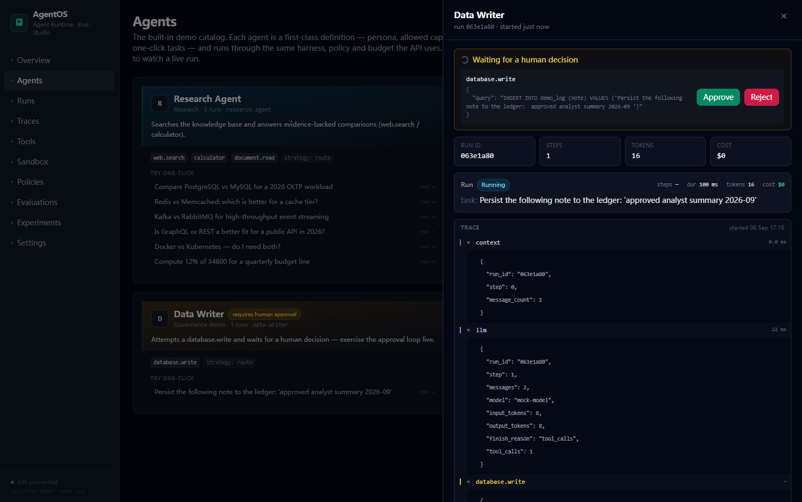
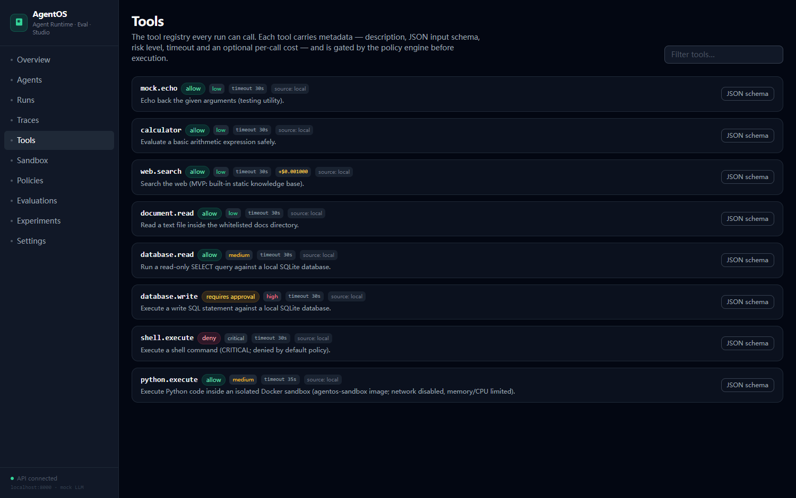
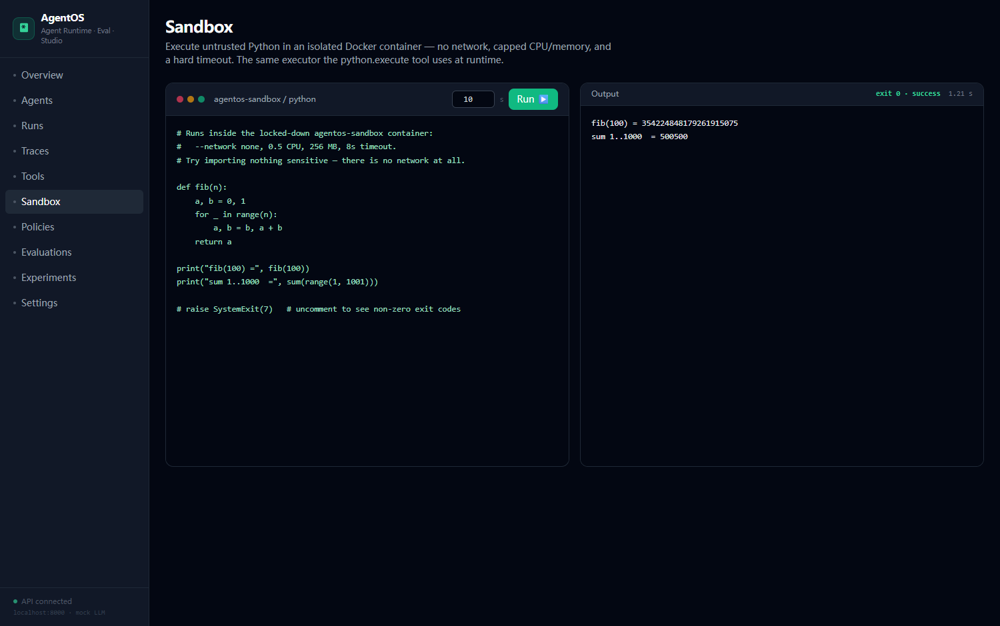
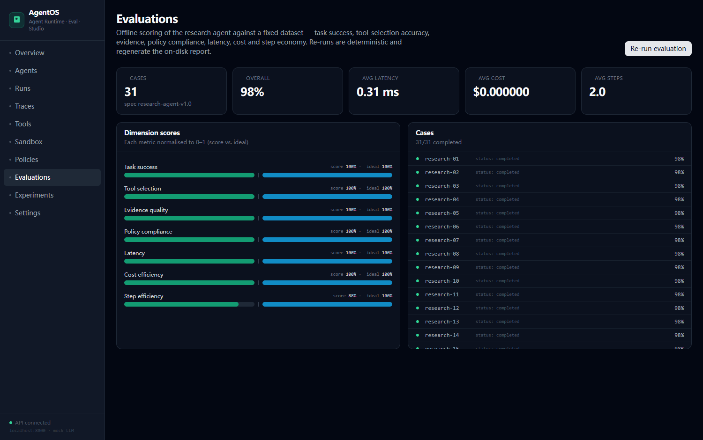
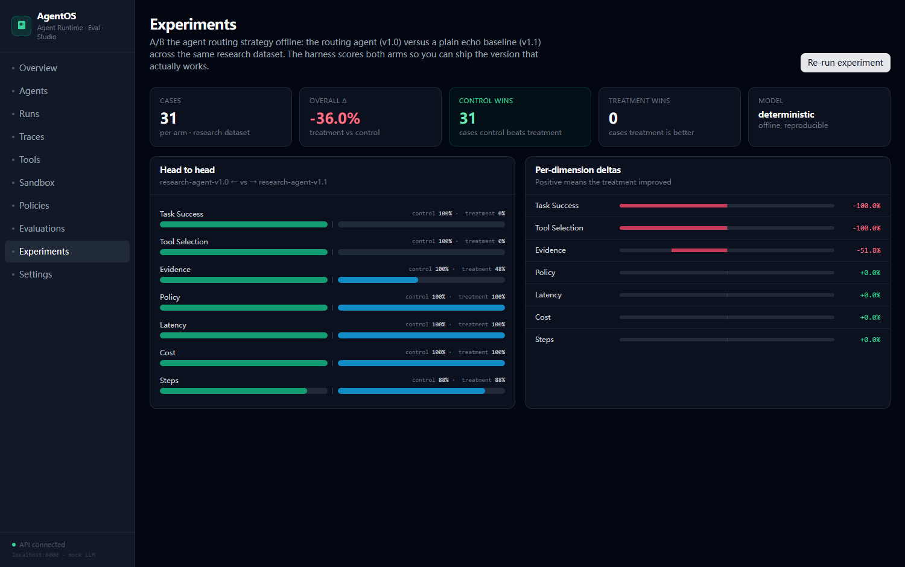
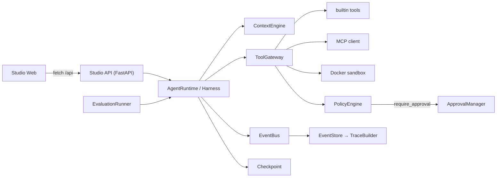

<p align="center">
  
</p>

<h1 align="center">AgentOS Studio</h1>

<p align="center">
  An <strong>open agent runtime</strong> + <strong>governed tool gateway</strong> + <strong>human-in-the-loop approvals</strong> + <strong>reproducible evaluation</strong> platform — with a complete web studio.
  <br/>
  Every row in the dashboards is produced by a <em>real run</em> against the same components that run your agents.
</p>

<p align="center">
  
  
  
  
  
  
  
</p>

---

## What is this?

AgentOS Studio is a layered, **provider-agnostic** platform for building,
governing, observing and evaluating LLM agents. It is intentionally *not* a
thin wrapper around one chat API. It ships the machinery you need for real,
managed agents:

- an **agent runtime** with a checkpointed execution loop and a context engine;
- a **tool gateway** where every tool call passes a policy check *before* it runs;
- **human-in-the-loop approvals** — a governed tool (e.g. `database.write`)
  pauses the whole agent mid-flight until a person clicks **Approve / Reject**;
- **budget & cost controls** using real token pricing;
- a **sandbox** (Docker) that `python.execute` / `shell.execute` run code inside;
- **flat events → span-tree traces** so observability is derived data, not a
  second code path;
- **offline evaluation** of a 31-case dataset and **A/B experiments** that
  compare whole agents — deterministically reproducible.

The web Studio (React) is a full, read/write console over that machinery:
10 screens, live-polling run views, an approval inbox, an in-browser sandbox,
editable policies, evaluation and experiment viewers.

> **Nothing is mocked at the orchestration layer.** The seeded demo, a live
> Studio run and an offline evaluation case all execute the same
> `ToolRegistry → Gateway → PolicyEngine → Harness → Runtime` stack. Only the
> LLM is swappable: deterministic `mock` (default, offline) or real
> DeepSeek / OpenAI-compatible providers.

## 图文演示 / Screenshot tour

| Studio | Overview | Runs & Traces |
|:---|:---|:---|
|  |  |  |

| Run detail | Human approval | Tools & policies |
|:---|:---|:---|
|  |  |  |

| Sandbox (in-browser) | Evaluations | Experiments (A/B) |
|:---|:---|:---|
|  |  |  |

> Full gallery: `screenshots/` — agents, runs, traces, tools, policies,
> sandbox, evaluations, experiments, settings, run detail, waiting-approval,
> live-run, overview.

## Demo you can reproduce (deterministic)

Run `python scripts/seed_demo.py` and — with no API keys, no network, fully
offline — you get the exact dashboard pictured above:

| Metric | Value |
|---|---:|
| Seeded runs | **9 / 9 completed (100%)** |
| Tool calls across runs | `web.search` ×6 · `calculator` ×2 · `database.write` ×2 |
| Token spend | **12,657** (12,058 in / 599 out), **est. $0.0039** @ DeepSeek pricing |
| Agents | 4 — Research, Data Analyst, Data Writer, Default |
| Policy rules | 8 — 6 `allow` · 1 `deny` · 1 `require_approval` |
| Human approval | 1 — the Data Writer's ledger write pauses for a human decision |
| Evaluation | 31 research cases → **overall 0.9821**, all 7 dimensions ≥ 0.875 |
| A/B experiment | `research-agent-v1.0` vs `v1.1` → control wins **31/31** (Δ overall **−0.3597**) |

Because the default LLM is a deterministic mock, the evaluation suite and the
A/B report are **byte-for-byte reproducible** — run them twice and you get the
same numbers. Swap in a real provider and the same harness scores real agent
behaviour.

## Architecture

Runtime, tools, governance, observability and evaluation are composed from
independent `packages/*` modules:



- **`packages/runtime`** — `AgentState`, `AgentHarness`, `AgentRuntime`,
  `ContextEngine`, `Checkpoint`, `Budget`. The execution loop that chats, plans
  tool calls, pauses for approvals, and checkpoints after every step.
- **`packages/tools`** — `ToolRegistry`, `ToolGateway` (standardised
  `{status, output, duration_ms}` envelope), `builtin` tools, an MCP client and
  the `docker/sandbox.Dockerfile` runner used by `python.execute`.
- **`packages/policy`** — `PolicyEngine` (`allow` / `deny` / `require_approval`),
  `ApprovalManager` + store. Enforcement happens **synchronously in the gateway**,
  so a governed tool can never run without the required decision.
- **`packages/llm`** — provider factory + `mock` (3 deterministic strategies,
  DeepSeek pricing model), `deepseek`, `openai`/compatible.
- **`packages/tracing`** — async `EventBus` recorder (ordered, serialised writes),
  `EventStore`, `TraceBuilder` (flat events → nested spans).
- **`packages/evaluation`** — offline `EvaluationRunner` (31-case research set),
  scoring on 7 normalised dimensions, plus A/B comparison reports.
- **`packages/sandbox`** — Docker executor with limits and artifact collection.
- **`apps/api`** — FastAPI + aiosqlite (no ORM): runs, approvals, policies,
  tools, sandbox, evaluation, stats, traces.
- **`apps/web`** — React 18 + TypeScript + Tailwind Studio (10 screens).

[`docs/architecture.md`](docs/architecture.md) has the full diagrams: run
lifecycle sequence, the governance / approval flow, the event→trace pipeline,
and the evaluation runner.

## Quick start

**Backend** (Python ≥ 3.11):

```bash
pip install -e ".[dev]"          # editable install + dev tools
python scripts/seed_demo.py      # build data/agentos.db: 9 canonical demo runs
uvicorn apps.api.main:app --port 8000
# API → http://localhost:8000  ·  docs → /docs  ·  health → /health
```

**Frontend** (Node ≥ 18):

```bash
cd apps/web
npm install
npm run dev                      # Studio → http://localhost:3000
```

Then open http://localhost:3000 — the Overview shows the seeded runs, and you
can launch one-click agent tasks, watch a live run pause for **Approve** on the
Data Writer's ledger write, run Python in the Sandbox page, and re-run the eval
or the A/B experiment.

### Docker (whole stack)

```bash
docker compose build && docker compose up     # web :3000 · api :8000
docker compose --profile build build sandbox  # optional: python.execute image
```

### Point it at a real LLM

Create `.env` (prefix `AGENTOS_`; the API reloads it on start):

```bash
AGENTOS_LLM_PROVIDER=deepseek            # mock | deepseek | openai | openai_compatible
AGENTOS_LLM_MODEL=deepseek-chat
AGENTOS_DEEPSEEK_API_KEY=sk-...          # or AGENTOS_OPENAI_API_KEY / _BASE_URL
```

With `mock` (the default) nothing is required — everything is offline and
deterministic. The stats/trace/cost dashboards keep working with a real key;
runs simply accrue real token cost against the provider's pricing model.

## Quality gates

```bash
ruff check .        # lint        — clean
mypy packages apps agents tests    # types — clean
pytest -q          # tests       — 51 passed
```

Tests cover the runtime loop, the tool gateway envelope + policy enforcement,
the approval pause/resume path, sandbox execution, the event-bus ordering
guarantee, and an end-to-end run over the HTTP API.

## Repository layout

```
apps/api         FastAPI service: routers, run_service, SQLite store
apps/web         React 18 + TS + Tailwind Studio (10 screens)
agents           agent catalog + per-agent definitions & one-click tasks
packages/
  runtime        AgentState · Harness · Runtime · Context · Checkpoint · Budget
  tools          ToolRegistry · Gateway · builtin tools · MCP client/server
  policy         PolicyEngine (allow/deny/require_approval) · ApprovalManager
  llm            provider factory · mock · deepseek · openai-compatible
  tracing        EventBus · EventStore · TraceBuilder
  evaluation     offline EvaluationRunner (31-case set) · A/B comparator
  sandbox        Docker executor + limits + artifact collector
  context        context assembly for tool-calling prompts
  memory         agent memory scaffolding
scripts/seed_demo.py    canonical, deterministic 9-run demo dataset
docs/architecture.md    architecture diagrams (system, runtime, governance, trace)
screenshots/            UI tour images used in this README
docker/                 sandbox Dockerfile
```

## Roadmap (how this was built)

- **Phase A** — monorepo skeleton: FastAPI api, React web scaffold, packages layout, tooling.
- **Phase B** — agent runtime core: state, harness, execution loop, checkpoint, LLM factory, context engine, memory.
- **Phase C** — tool registry, policy-hooked gateway, MCP client/server over stdio.
- **Phase D** — Docker sandbox: executor, limits, artifact collector, wired into `python.execute`.
- **Phase E** — policy engine, budget control, human-approval flow + the approvals API.
- **Phase F–G** — tracing (flat events → span trees) + offline evaluation & A/B experiments.
- **Phase H** — the full React Studio wired to the real API.
- **Phase I** — agent catalog + deterministic seed so the demo is reproducible offline.

## License

[MIT](LICENSE) © 2026 贺朝晖 (Hacker-me18)

---

**中文版**：请见 [docs/README.zh-CN.md](docs/README.zh-CN.md)（Chinese translation）。
