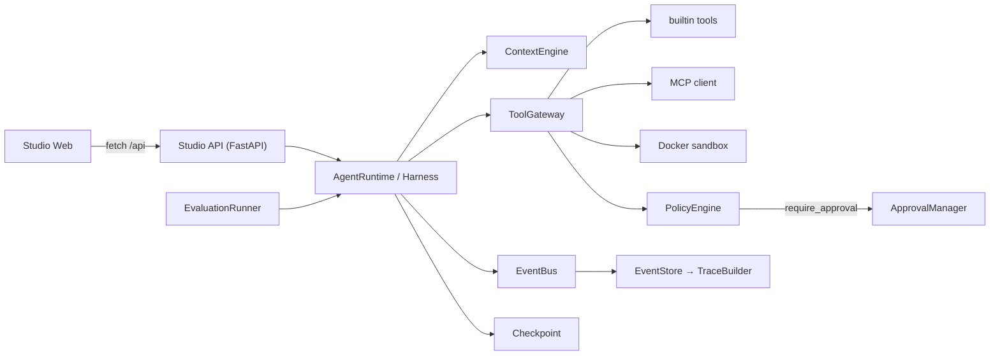

# AgentOS Studio（中文版）

> 英文版：[`README.md`](../README.md)（English）

**AgentOS Studio** 是一个分层的、**与模型提供商解耦**的 Agent 运行时 / 治理 / 观测 / 评测平台,并附带一个完整的 Web 控制台(Studio)。

它不是某个聊天 API 的薄封装。它提供构建「受管智能体」所需的整套机制:

- **Agent 运行时**:带检查点(checkpoint)的执行循环与上下文引擎;
- **工具网关(ToolGateway)**:每一次工具调用在真正执行前,都会先经过策略检查;
- **人在回路(HITL)审批**:被治理的工具(如 `database.write`)会让整个 Agent **暂停**,等待真人点击 **Approve / Reject**;
- **预算与成本控制**:基于真实 token 计价的成本核算;
- **沙箱**:用 Docker 承载 `python.execute` / `shell.execute` 的代码执行;
- **可观测性**:「扁平事件 → 嵌套 Span 树」,追踪是被推导出的数据,而非另一套代码路径;
- **离线评测与 A/B 实验**:对 31 个 case 的评测集打分、对整组 Agent 做对比,结果**可复现**。

Web Studio(React)是这套机制之上的完整读写控制台:10 个页面、实时轮询的运行视图、审批收件箱、浏览器内沙箱、可编辑策略、评测与实验查看器。

> **编排层没有任何 mock。** 种子演示、Studio 里的一次在线运行、离线评测的单个 case,走的都是同一条 `ToolRegistry → Gateway → PolicyEngine → Harness → Runtime` 链路;只有 LLM 是可替换的:默认用确定性的 `mock`(完全离线),也可以切换到 DeepSeek / OpenAI 兼容的真实模型。

## 截图巡览

| 总览 | 运行列表 | 追踪(Traces) |
|:---|:---|:---|
|  |  |  |

| 运行详情 | 人工审批 | 工具与策略 |
|:---|:---|:---|
|  |  |  |

| 沙箱(浏览器内) | 评测 | A/B 实验 |
|:---|:---|:---|
|  |  |  |

完整图集在 `screenshots/` 目录。

## 可复现的演示(确定性)

执行 `python scripts/seed_demo.py`,无需任何 API Key、无需联网,即可得到与上面截图完全一致的面板:

| 指标 | 数值 |
|---|---:|
| 种子运行 | **9 / 9 完成(100%)** |
| 跨运行工具调用 | `web.search` ×6 · `calculator` ×2 · `database.write` ×2 |
| Token 用量 | **12,657**(输入 12,058 / 输出 599),按 DeepSeek 计价估算 **≈ $0.0039** |
| Agent | 4 个 — 研究、数据分析师、数据写入、默认 |
| 策略规则 | 8 条 — 6 `allow` · 1 `deny` · 1 `require_approval` |
| 人工审批 | 1 次 — 数据写入 Agent 的账本写入需人工放行 |
| 评测 | 31 个 research case → **总体 0.9821**,7 个维度均 ≥ 0.875 |
| A/B 实验 | `research-agent-v1.0` vs `v1.1` → 对照组胜 **31/31**(总体 Δ **−0.3597**) |

因为默认 LLM 是确定性的 mock,评测套件与 A/B 报告可以**逐字节复现**——跑两次数字完全一样;换成真实模型后,同一套 harness 就能给真实行为打分。

## 架构



- **`packages/runtime`** — `AgentState`、`AgentHarness`、`AgentRuntime`、`ContextEngine`、`Checkpoint`、`Budget`。
- **`packages/tools`** — `ToolRegistry`、`ToolGateway`(统一的 `{status, output, duration_ms}` 信封)、`builtin` 工具、MCP 客户端,以及 `docker/sandbox.Dockerfile` 运行器。
- **`packages/policy`** — `PolicyEngine`(`allow`/`deny`/`require_approval`)与 `ApprovalManager`;在网关注入点**同步执行**,受治理的工具绝不越过决策运行。
- **`packages/llm`** — 提供方工厂:`mock`(3 种确定性策略,内置 DeepSeek 计价)、`deepseek`、`openai`/兼容。
- **`packages/tracing`** — 异步 `EventBus`(有序、串行化写入)、`EventStore`、`TraceBuilder`。
- **`packages/evaluation`** — 离线 `EvaluationRunner`(31 个 research case),7 维归一化打分,外加 A/B 对比报告。
- **`packages/sandbox`** — Docker 执行器(带资源限制与产物收集)。
- **`apps/api`** — FastAPI + aiosqlite(无 ORM)。
- **`apps/web`** — React 18 + TypeScript + Tailwind 的 Studio(10 屏)。

详细时序图(运行生命周期、审批流程、事件→追踪、评测流水线)见 [`docs/architecture.md`](architecture.md)。

## 快速开始

**后端**(Python ≥ 3.11):

```bash
pip install -e ".[dev]"
python scripts/seed_demo.py      # 生成 data/agentos.db:9 条规范演示运行
uvicorn apps.api.main:app --port 8000
```

**前端**(Node ≥ 18):

```bash
cd apps/web
npm install
npm run dev                      # Studio → http://localhost:3000
```

打开 http://localhost:3000,即可:在 Overview 看到种子运行;点击 Agent 卡片的一键任务,观察 Data Writer 的写库操作**暂停等待审批**;在沙箱页运行 Python;重跑评测或 A/B 实验。

### Docker(一键整栈)

```bash
docker compose build && docker compose up     # web :3000 · api :8000
docker compose --profile build build sandbox  # 可选:python.execute 镜像
```

### 接入真实 LLM

新建 `.env`(前缀 `AGENTOS_`):

```bash
AGENTOS_LLM_PROVIDER=deepseek            # mock | deepseek | openai | openai_compatible
AGENTOS_LLM_MODEL=deepseek-chat
AGENTOS_DEEPSEEK_API_KEY=sk-...          # 或 AGENTOS_OPENAI_API_KEY / _BASE_URL
```

默认 `mock` 不需要任何配置,完全离线且确定性;换成真实 Key 后,统计 / 追踪 / 成本面板依旧可用,运行会按对应模型的计价累积真实 token 费用。

## 质量门禁

```bash
ruff check .        # lint — 干净
mypy packages apps agents tests    # 类型 — 干净
pytest -q          # 测试 — 51 通过
```

## 目录结构

```
apps/api         FastAPI 服务(路由 / run_service / SQLite 存储)
apps/web         React 18 + TS + Tailwind Studio(10 屏)
agents           Agent 目录与一键演示任务
packages/
  runtime        AgentState · Harness · Runtime · Context · Checkpoint · Budget
  tools          ToolRegistry · Gateway · builtin · MCP client/server
  policy         PolicyEngine · ApprovalManager
  llm            提供方工厂 · mock · deepseek · openai-compatible
  tracing        EventBus · EventStore · TraceBuilder
  evaluation     离线 EvaluationRunner · A/B 比较
  sandbox        Docker 执行器 + 限制 + 产物收集
scripts/seed_demo.py    确定性演示数据集(9 条运行)
docs/architecture.md    架构图
screenshots/            UI 图集
docker/                 沙箱 Dockerfile
```

## 构建历程

- **Phase A** — Monorepo 骨架:FastAPI api、React web、packages 布局、工程化工具。
- **Phase B** — Agent 运行时核心:状态、harness、执行循环、checkpoint、LLM 工厂、上下文引擎、记忆。
- **Phase C** — 工具注册表、接入策略钩子的网关、基于 stdio 的 MCP 客户端/服务端。
- **Phase D** — Docker 沙箱:执行器、资源限制、产物收集,并接入 `python.execute`。
- **Phase E** — 策略引擎、预算控制、人工审批流 + 审批 API。
- **Phase F–G** — 追踪(扁平事件 → Span 树)与离线评测 / A/B 实验。
- **Phase H** — 接入真实 API 的完整 React Studio。
- **Phase I** — Agent 目录 + 确定性种子,演示可离线复现。

## License

[MIT](../LICENSE) © 2026 贺朝晖 (Hacker-me18)
