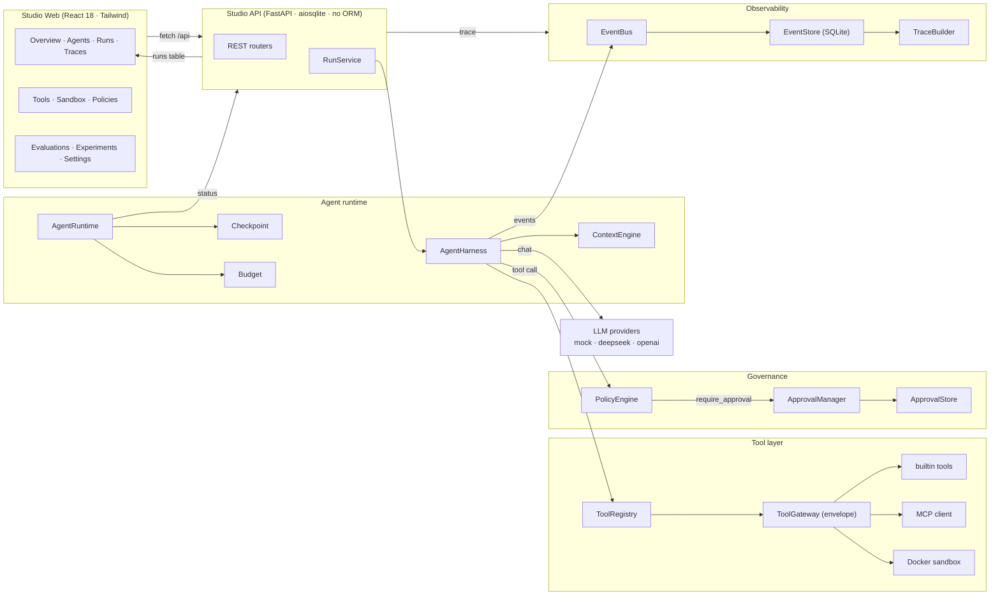
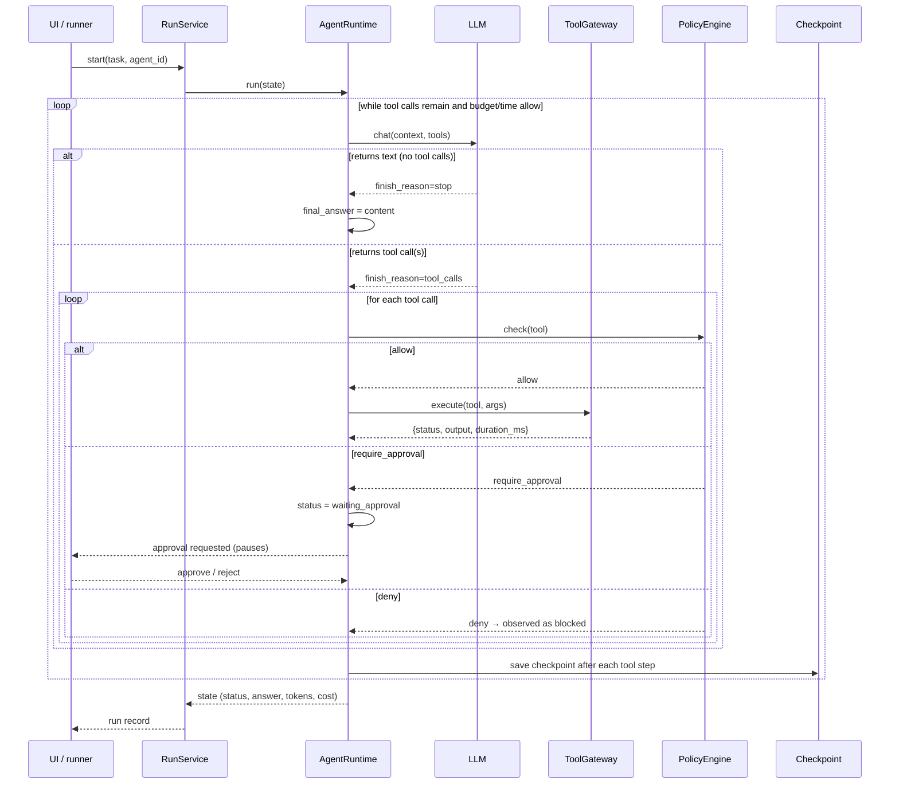
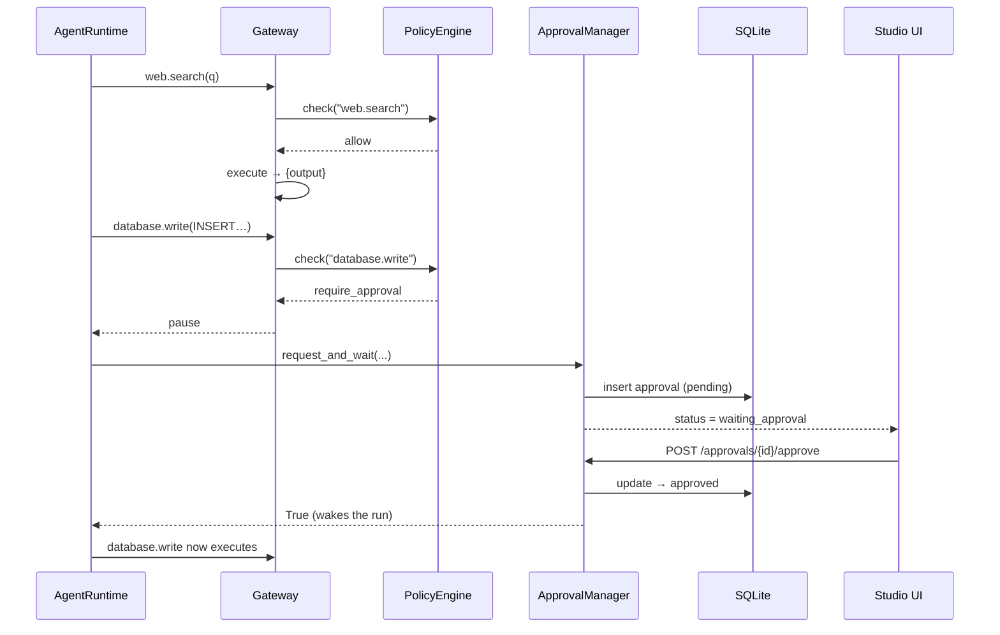
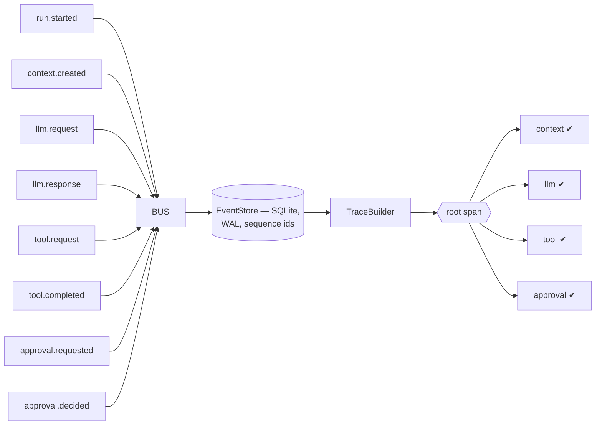
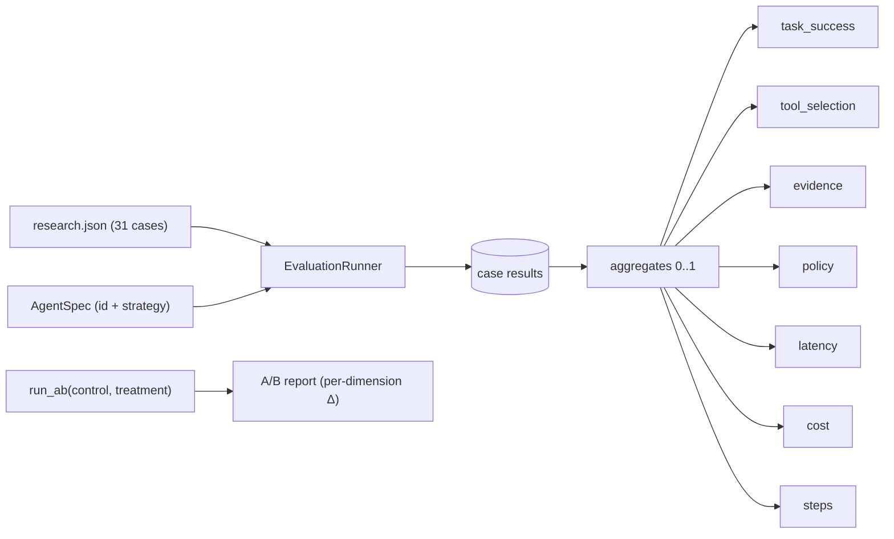

# AgentOS Studio — Architecture

AgentOS Studio is a **layered, provider-agnostic agent runtime and evaluation
platform**. Each capability lives in its own `packages/*` module and is composed
at runtime by the FastAPI service and by the offline evaluation runner — the
*exact same* components run a live Studio run, a seeded demo run, and an
offline evaluation case. Nothing is mocked at the orchestration layer.

## 1. Run lifecycle

Every run — seeded, manual, or evaluated — follows the same loop inside
`AgentRuntime`:

## 2. Governance & human approval

Policies map tools to `allow | deny | require_approval`. The gateway enforces
them synchronously *before* a tool executes, so a governed tool can never run
without a human decision — even while the agent is mid-flight:

## 3. Observability: flat events → span tree

Emitters (harness, gateway, sandbox) record **flat, ordered events** through an
asynchronous event bus. `TraceBuilder` reconstructs a nested span tree purely
from that stream, so the Trace view is derived data — never a second code path:

## 4. Evaluation & A/B experiments

The offline runner feeds a fixed dataset through the same harness and scores
each case on seven normalised dimensions, then compares whole agents:

The results are deterministic (mock LLM), so `POST /api/eval/report/eval/run`
re-produces identical reports — evaluation is a first-class, reproducible
artifact, not a one-off script.
